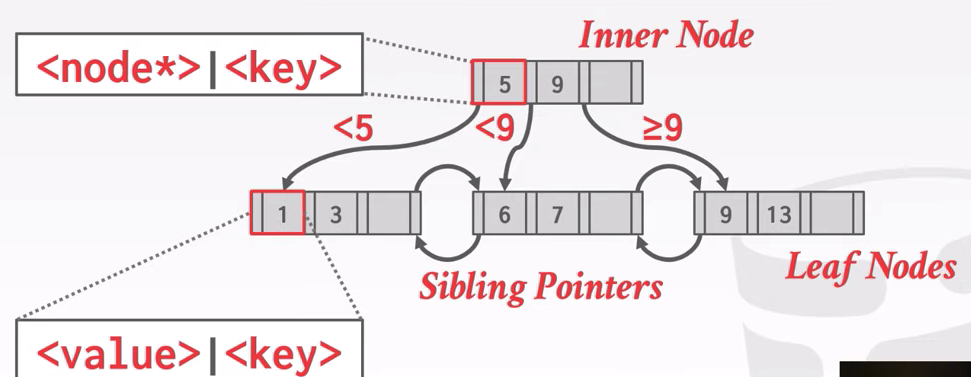
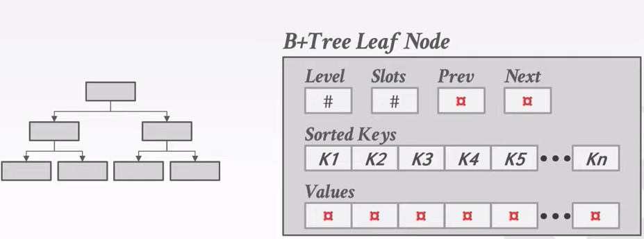
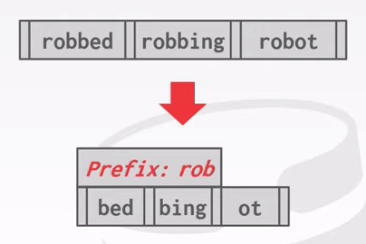
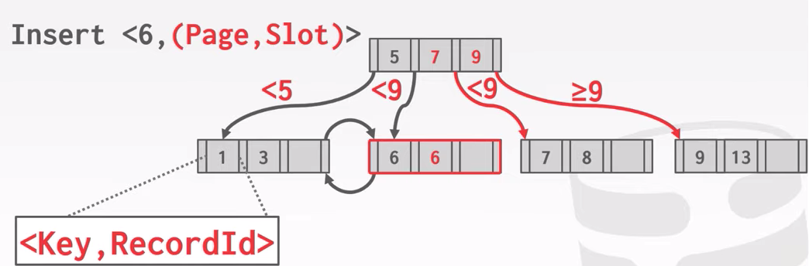
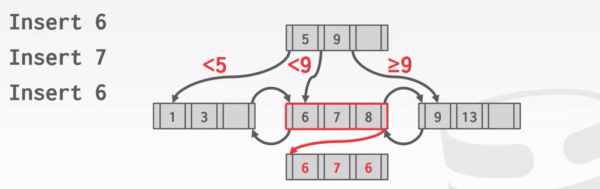
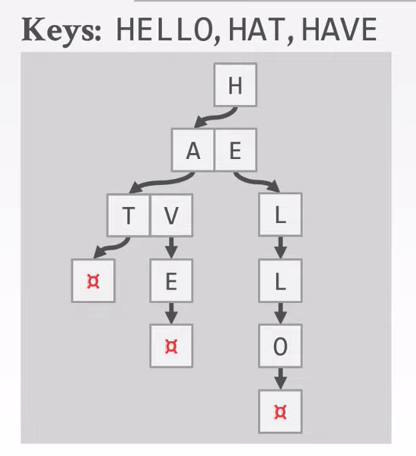
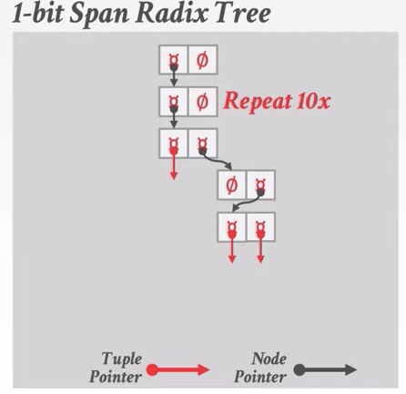

# Tree Indexes

## Table Indexes

A table index is a replica of a subset of a table's attribtues that are organized and/or sorted for efficient access using a subset of those attributes.

The DBMS ensures that the contents of the table and the index are logically in sync.

## B+ Tree Overview

A self-balancing tree data structure that keeps data sorted and allows searches, sequential access, insertions, and deletions in O(log n).

B+ Tree is an M-way search tree with the following properties:

- It is perfectly balanced (every leaf node is at the same depth)
- Every node other than the root, is at least half-full (M/2 - 1 <= #keys <= M - 1)
- Every inner node with k keys has k + 1 non-null children



### Nodes

Every B+ Tree node is comprised of an array of key/value pairs.

- The keys are derived from the attributes that the index is based on
- The values will differ based on whether the node is classified as inner nodes or leaf nodes

#### Leaf Nodes



#### Leaf Node Values

- Record Id: A pointer to the location of the tuple that the index entry corresponds to.
- Tuple Data: The actual contents of the tuple is stored in the leaf node. Secondary indexes have to store the record id as their values.

### B-Tree VS B+ Tree

B-Tree: Store keys + value in all nodes in the tree, more space efficient since each key only appears once in the tree.

B+ Tree: Only stores values in leaf nodes, inner nodes only guide the search process.

### Prefix Compression

Sorted keys in the same leaf node are likely to have the same prefix.

Instead of storing the entire key each time, extract common prefix and store only unique suffix for each key.



### Suffix Truncation

The keys in the inner nodes are only used to direct traffic, don't need the entire key.

Store a minimum prefix that is needed tp correctly route probes into the index.

### Pointer Swizzling

Nodes use page ids to reference other nodes in the index. The DBMS must get the memory location from the page table during traversal.

If a page is pinned in the buffer pool, then we can store raw pointers instead of page ids. This avoids address lookups from the page table.

### Duplicate Keys

Append Record Id

- Add the tuple's unique record id as part of the key to ensure that all keys are unique
- The DBMS can still use partial keys to find tuples



Overflow Leaf Nodes

- Allow leaf nodes to spill into overflow nodes that contain the duplcate keys
- This is more conplex to maintain and modify




### Implicit Indexes

Most BDMSs automatically create an index to enforce integrity constraints but not referential constraints(foreign keys)

- Primary Keys
- Unique Constraints

### Partial Indexes

Create an index on a subset of the entire table. This potentially reduces its size and the amount of overhead to maintain it.

One common use case is to partition indexes by date ranges.

- Create a separate index per month, year.

```sql
CREATE INDEX idx_foo ON foo(a, b) WHERE c = 'ABC'
```

### Convering Indexes

If all the fields needed to process the query are available in an index, then the DBMS does not need to retrieve the tuple.

This reduces contention on the DBMS's buffer pool resources.

```sql
CREATE INDEX idx_foo ON foo(a, b);

SELECT b FROM foo WHERE a = 123;
```

### Index Include Columns

Embed additional columns in indexes to support index-only queries.

These extra columns are only stored in the leaf nodes and are not part of the search key.

```sql
CREATE INDEX idx_foo ON foo(a, b) INCLUDE (c);

SELECT b FROM foo WHERE a = 123 AND c = 'abc';
```

### Functional/Expression Indexes

An index does not need to store keys in the same way that they appear in their base table.

You can use expressions when declaring an index.

```sql
SELECT * FROM users WHERE EXTRACT(dow FROM login) = 2;

CREATE INDEX index_user_login ON users(EXTRACT(dow FROM login));
```

## Observation

The inner node keys in a B+ Tree cannot tell you whether a key exists in the index. You must always traverse to the leaf node.

This means that you cloud have(at least) one buffer pool page miss per level in the tree just to find out a key does not exist.

The tree indexes are useful for point and rage queries, not good at keyword searches.

## Trie Index

Use a digital representation of keys to examine prefixes one-by-one instead of comparing entire key.



Shape only dependes on key space and lengths.

- Does not depend on existing keys or insertion order
- Does not require rebalancing operations

All operations have O(k) complexity where k is the length of the key.

## Radix Tree

Omit all nodes with only a single child.

Can Produce false positives, so the DBMS always checks the original tuple to see whether a key matches.



## Inverted Index

An inverted index stores a mapping of words to records that contain those words in the target arrtibute.
