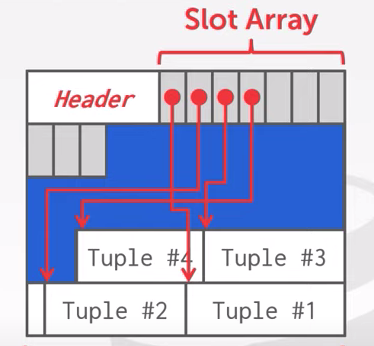
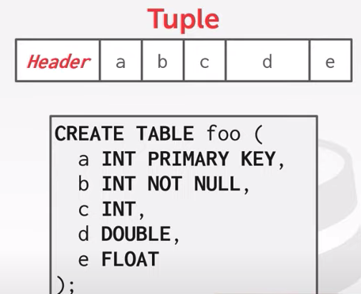
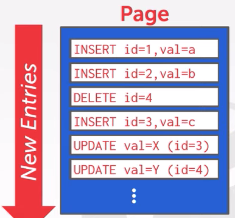
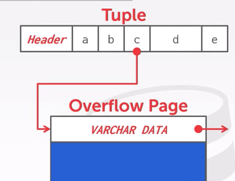
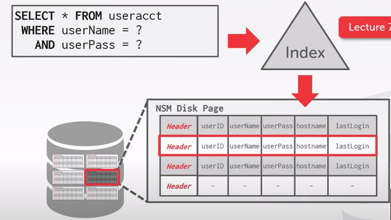
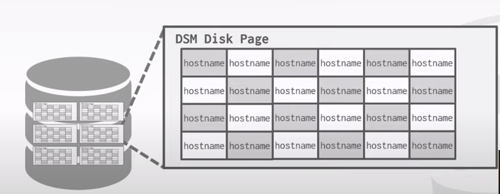

# Database Storage

The DBMS assumes that the primary storage location of database is on non-volatile disk. The DBMS's components manage the movement of data between non-volatile and volatile storage.

## Why not use the OS

- madvise: Tell the OS how you expect to read certain pages
- mlock: Tell the OS that memory ranges cannot be paged out
- msync: Tell the OS to flush memory ranges out to disk

DBMS always wants to control things itself and can do a better job at it

- Flushing dirty pages to disk in the correct order
- Specialized prefetching
- Buffer replacement policy
- Thread/process scheduling

## File Storage

The DBMS stores a databse as one or more files on disk.

### Storage Manager

Responsible for maintaining a database's files, it organizes the files as a collection of pages.

A page is a fixed-size block of data.

- It can contain tuples, meta-data, indexes, log records...
- Most systems do not mix page types
- Some system require a page to be self-contained
- Each page is given a unique identifier, the DBMS uses a indirection layer to map page ids to physical locations

Pages in DBMS, by hardware page, we mean at what level the device can guarantee a "failsafe write".

- Hardware Page (usually 4KB)
- OS Page (usually 4KB)
- Database Page (512B - 16KB)

### Page Storage Architecture

#### Database Heap

A heap file is an unordered collection of pages where tuples that are stored in random order.

Need meta-data to keep track of what pages exist and which ones have free space.

##### Linked List

Maintain a header page at the beginning of the file that stores two pointers:

- Head of the free page list
- Head of the data page list

Each page keeps track of the number of free slots in itself.

##### Page Directory

The DBMS maintains special pages that tracks the location of data pages in the database files, also records the number of free slots per page.

The DBMS has to make sure that the directory pages are in sync with the data pages.

**Page Header**

Every page contains a header of metadata about the page's contents.

- Page Size
- Checksum
- DBMS Version
- Transaction Visibility
- Compression Information

Some systems require pages to be self-contained(e.g. Oracle)

## Page Layout

**Strawman Idea**
Keep track of the number of tuples in a page and then just append a new tule to the end.

|page|
|---|
|num tuples = 3|
|Tuple #1|
|Tuple #2|
|Tuple #3|

- What happens if we delete a tuple
- What happens if we have a variable length attribute

### Slotted Pages

The slot array maps slots to the tuples' starting position offsets.

The header keeps track of:

- The # of used slots
- The offset of the tarting location of the last slot used



### Record IDs

Each tuple is assigned a unique record identifier

- Most common: page_id + offset/slot
- Can also contain file location info

**Postgres**

ctid(8 bytes)
```sql
SELECT ctid, * FROM r

ctid | id | val
-----+----+----
(0,1)| 101| aaa

-- Compact pages
VACUUM FULL;
```

## Tuple Layout

### Tuple Header

- Visibility info (concurrency control)
- Bit Map for NULL values

### Tuple Data

Attributes are typically stored in the order that you specify them when you create the table.




## Log-Sturctured File Organization

The system appends log records to the file of how the database was modified.



- Scans the log backwards and recreates the tuple to find what it needs
- Build indexes to allow it to jump to locations in the log
- Periodically compact the log

## Data Representation

A tuple is essentially a sequence of bytes. The DBMS's catalogs contain the schema information about tables that the system uses to figure out the tuple's layout.

### Real/Decimal

### Large Values

Most DBMSs don't allow a tuple to execeed the size of a single page.

To store values that are larger than a page, the DBMS uses separate overflow storage pages.

- Postgres: TOAST (>2KB)



Some systems allow you to store a really large value in an external file. Treated as a BLOB type.

- Oracle: BFILE data type
- Microsoft: FILESTREAM data type

The DBMS cannot manipulate the contents of an external file.

- No durability, transaction protections

## System Catalogs

A DBMS stores meta-data about databases in its internal catalogs.

- Tables, columns, indexes, views
- Users, permissions
- Internal statistics

### OLTP

On-line Transaction Processing

- Simple queries that read/update a small amount of data that is related to a single entity in the database.

### OLAP

On-line Analytical Processing

- Complex queries that read large portions of the database spanning multiple entities.

## Storage Models

### N-Ary Storage Model (NSM)

The DBMS stores all attributes for a single tuple contiguously in a page.

Ideal for OLTP workloads where queries tend to operate only on an individual entity and insert-heavy workloads.



Advantages

- Fast inserts updates, and deletes
- Good for queries that need the entire tuple

Disadvantages

- Scanning large portions of the table and/or a subset of the attribtues

### decomposition Storage Model (DSM)

The DBMS stores the values of a single attribute for all tuples contiguously in a page.

- Also known as a column store



#### Tuple Identification

Fixed-length Offsets: Each value is the same length for an attribute.

Embedded Tuple Ids: Each value is stored with its tuple id in a column.

Advantages

- Reduces the amount wasted I/O because the DBMS only reads the data that it needs
- Better query processing and data compression

Disadvantage

- Slow for point queries, inserts, updates, and deletes because of tuple splitting/stitching
