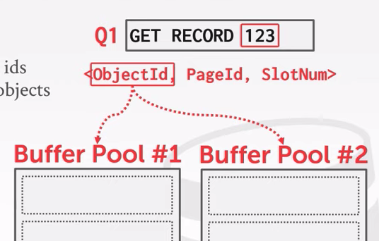

# Buffer Pools

## Database Storage

Spatial Control

- Where to write pages on disk
- The goal is to keep pages that are used together often as phsically close together as possible on disk

Temporal Control

- When to read pages into memory, and when to write then to disk
- The goal is minimize the number of stalls from having to read data from disk

## Buffer Pool Manager

### Buffer Pool Organization

Memory region organized as an array of fixed-size pages. An array entry is called a frame.

When the DBMS requests a page, an exact copy is placed into one of these frames.

### Buffer Pool Metadata

The page table keeps track of pages that are currently in memory.

Additional metadata per-page

- Dirty Flag
- Pin/Reference Counter

### Locks VS Latches

Locks:

- Protects the database's logical contents from other transaction
- Held for transaction duration
- Need to be able to rollback changes

Latches (Mutex):

- Protects the critical sections of the DBMS's internal data structure from other threads
- Held for operation duration
- Do not need to be able to rollback changes

### Page table VS Page Directory

Page Directory: Mapping from page ids to page locations in the database file

- All changes must be recorded on disk to allow the DBMS to find on restart

Page Table: Mapping from page ids to a copy of the page in buffer pool frames

- This is an in-memory data structure that does not need to be stored on disk

### Allocation Policies

Global Policies

- Make dicisions for all action txns

Local Policies

- Allocate frames to a specific txn without considering the behavior of concurrent txns
- Still need to support sharing pages

### Buffer Pool Optimizations

#### Multiple Buffer Pools

Helps reduce latch contention and improve locality

- Multiple buffer pool instances
- Per-database buffer pool
- Per-page type buffer pool

Approach:

Object Id

- Embed an object identifier in record ids and the maintain a mapping from objects to specific buffer pools

Hashing

- Has the page id to select which buffer pool to access

#### Pre-Fetching

The DBMS can also prefect pages based on a query plan.

- Sequential Scans
- Index Scans

#### Scan Sharing

Queries can reuse data retrieved from storage or operator computations.

Allow multiple queries to attach to a single cursor that scans a table.

- Queries do not have to be exactly the same
- Can also share intermediate results

#### Buffer Pool Bypass

The sequential scan operator will not store fetched pages in the buffer pool to avoid overhead.

#### OS Page Cache

Most disk operations go through the OS API, unless you tell it not to, the OS maintains its own filesystem cache.

Most DBMSs use direct I/O (O_DIRECT) to bypass the OS's cache

- Redundant copies of pages
- Different eviction policies

## Replacement Policies

### LRU

Maintain a timestamp of when each page was last accessed, evict the one with the oldes timestamp.

### Clock

Approximation of LRU without needing a separate timestamp per page.

- Each page has a reference bit
- When a page is accessed, set to 1

Organize the pages in a circular buffer with a clock hand

- Upon sweeping, check if a page's bit is set to 1
- If yes, set to zero. If no, then evict

### Problems

Sequential flooding

- A query perform a sequential scan that reads every page
- This pollutes the buffer pool with pages that are read once and then never again

### LRU-K

Track the history of last K references to each page as timestamps and computethe interval between subsequent accesses.

The DBMS then uses this history to estimate the next time that page is going to be accessed.

### Localization

The DBMS chooses whichi pages to evict on a per txn/query basis. This minimizes the pollution of the buffer pool from each query.

### Priority Hints

The DBMS knows what the context of each page during query execution. It can provide hints to the buffer pool on whether a page is important or not.

### Dirty Pages

Not dirty, then the DBMS can simply drop it.

Dirty, write back to disk to ensure that its changes are persisted.

Background Writing: The DBMS can periodically walk through the page table and write dirty pages to disk. Not write dirty pages before their log records have been written.
