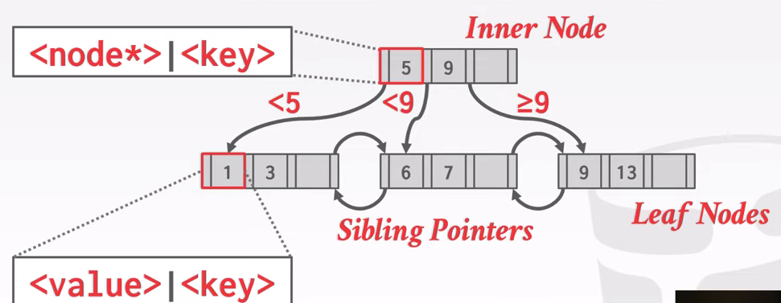
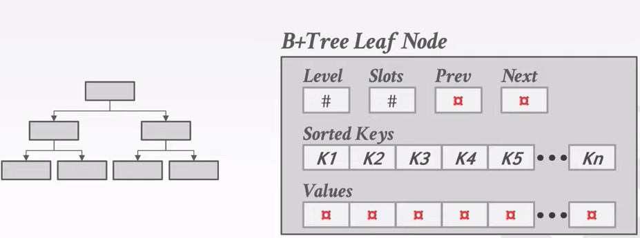

# Tree Indexes

## Table Indexes

A table index is a replica of a subset of a table's attribtues that are organized and/or sorted for efficient access using a subset of those attributes.

The DBMS ensures that the contents of the table and the index are logically in sync.

## B+ Tree Overview

A self-balancing tree data structure that keeps data sorted and allows searches, sequential access, insertions, and deletions in O(log n).

B+ Tree is an M-way search tree with the following properties:

- It is perfectly balanced (every leaf node is at the same depth)
- Every node other than the root, is at least half-full (M/2 - 1 <= #keys <= M - 1)
- Every inner node with k keys has k + 1 non-null children

### Nodes

Every B+ Tree node is comprised of an array of key/value pairs.

- The keys are derived from the attributes that the index is based on
- The values will differ based on whether the node is classified as inner nodes or leaf nodes

#### Leaf Nodes

#### Leaf Node Values

- Record Id: A pointer to the location of the tuple that the index entry corresponds to.
- Tuple Data: The actual contents of the tuple is stored in the leaf node. Secondary indexes have to store the record id as their values.

### B-Tree VS B+ Tree

B-Tree: Store keys + value in all nodes in the tree, more space efficient since each key only appears once in the tree.

B+ Tree: Only stores values in leaf nodes, inner nodes only guide the search process.

### Prefix Compression

Sorted keys in the same leaf node are likely to have the same prefix.

Instead of storing the entire key each time, extract common prefix and store only unique suffix for each key.

### Suffix Truncation

The keys in the inner nodes are only used to direct traffic, don't need the entire key.

Store a minimum prefix that is needed tp correctly route probes into the index.

### Pointer Swizzling

Nodes use page ids to reference other nodes in the index. The DBMS must get the memory location from the page table during traversal.

If a page is pinned in the buffer pool, then we can store raw pointers instead of page ids. This avoids address lookups from the page table.
