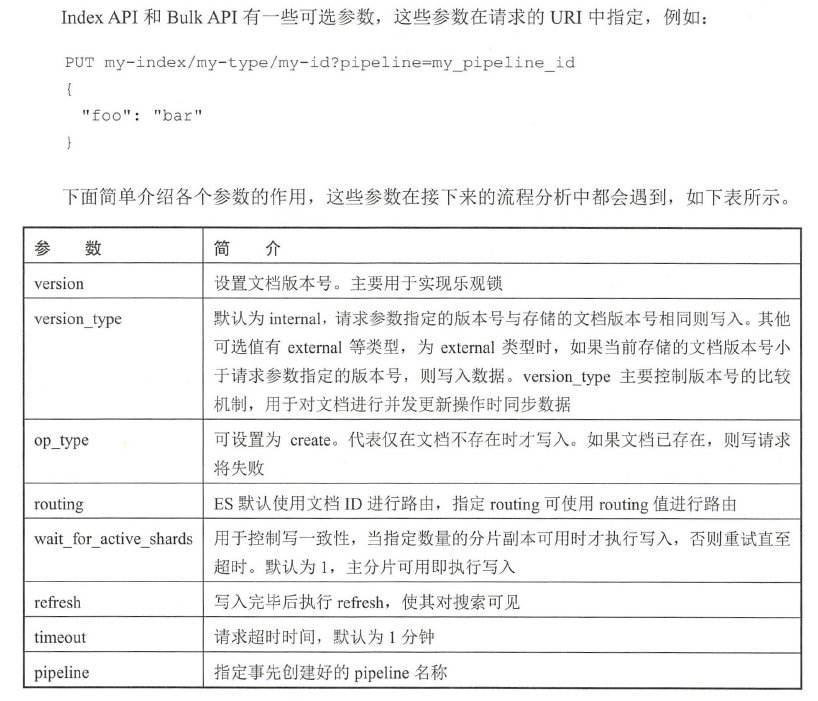
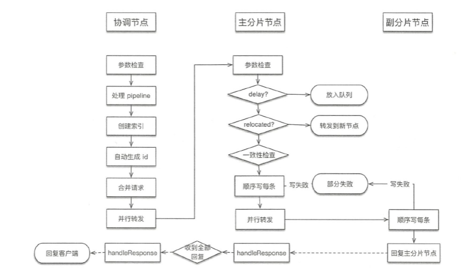
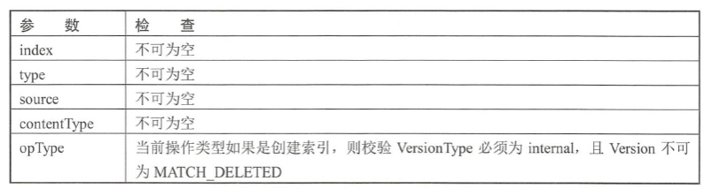
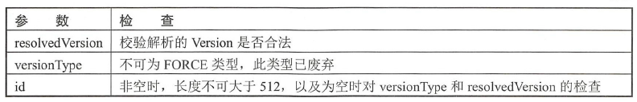
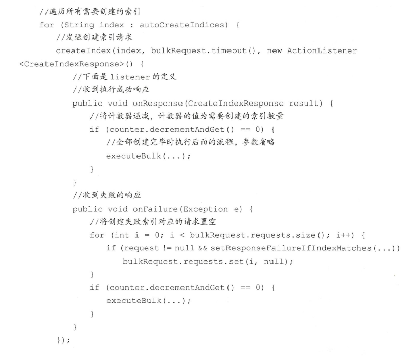

## 写流程

ES中文档操作类型

```java
enum OpType {
    INDEX(0),
    CREATE(1),
    UPDATE(2),
    DELETE(3)
}
```

- INDEX: 向索引中put一个文档，即索引一个文档
- CREATE: put请求设置op_type为create，如果文档存在，则请求失败
- UPDATE: put一个文档如果存在，则更新文档
- DELETE: 删除文档

### 可选参数



### Index/Bulk流程

写操作必须先在主分片执行成功后，才能复制到相关的副分片。



#### 协调节点流程

协调节点负责创建索引、转发请求到主分片节点、等待响应、回复客户端。

##### 检查参数




##### 处理pipeline请求

预处理数据，通过一系列processors组成的pipeline实现。如何Index或Bulk请求中指定了pipeline参数，则先试用相应的pipeline进行处理，如果本节点不具备预处理资格，则转发至其他节点。

添加pipeline

```json
PUT _ingest/pipeline/my-pipeline-id
{
    "description":"my pipeline",
    "processors": {
        "set": {
            "field": "foo",
            "value": "bar"
        }
    }
}
```

##### 自动创建索引

计算请求中涉及的索引，如不存在，进行创建（默认允许），如部分创建失败，对应请求被标记为失败，其他索引正常执行写流程。



##### 写请求预处理

只检查参数、自动生成id，处理routing等。

先获取集群状态信息，获取索引元信息，检查mapping、routing、id等，如不存在，则生成uuid作为文档id。

> TransportBulkAction.BulkOperation#doRun

##### 检测集群状态

协调节点在开始处理时会先检测集群状态，若集群异常则取消写入，如master不存在会阻塞等待，直至超时。

```java

final ClusterState clusterState = observer.setAndGetObservedState();
if (handleBlockExceptions(clusterState)) {
    return;
}
```

##### 内容路由，构建基于shard的请求

将bulkRequest重新组织为基于shard请求列表，将属于同一个主分片的文档进行合并。

shard请求结构如下

```java
Map<ShardId, List<BulkItemRequest>> requestsByShard = new HashMap<>();

public class ShardId {
    // 分片所属索引
    private Index index;
    // 从0递增序号
    private int shardId;
    private int hashCode;
}

```

##### 路由算法

根据routing和文档id计算shardId。默认情况下routing为文档id。

> shard_num = has(_routing) % num_primary_shards

可通过index.routing_partition_size参数减小数据倾斜风险，取值大于1，小于index.number_of_shards

配置后，计算公式如下

> shard_num = (hash(_routing) + hash(_id) % routing_partition_size) % num_primary_shards

```java
private static int calculateScaledShardId(IndexMetaData indexMetaData, String effectiveRouting, int partitionOffset) {
    final int hash = Murmur3HashFunction.hash(effectiveRouting) + partitionOffset;
    return Math.floorMod(hash, indexMetaData.getRoutingNumShards()) / indexMetaData.getRoutingFactor();
}
```

effectiveRouting是id或设置的routing值，partitionOffset一般为0，设置index.routing_partition_size情况下取值为

```java
partitionOffset = Math.floorMod(Murmur3HashFunction.hash(id), indexMetaData.getRoutingPartitionSize());

```

indexMetaData.getRoutingNumShards()值为routingNumShards,其取决于配置: index.number_of_routing_shards，如果没有配置，routingNumShards值等于numberOfShards。

indexMetaData.getRoutingFactor()值为

routingNumShards / numberOfShards

numberOfShards取值取决于配置：index.number_of_shards

##### 转发请求并等待响应

根据集群状态中内容路由表确定主分片所在节点，转发请求并等待响应。

辨析所有需要写的shard，封装BulkShardRequest，调用TransportShardBulkAction#execute发送，
在listener中等待响应
。
如一个shard部分doc失败，记录异常信息到response，整体请求为成功。

待收到所有响应后，回复客户端。

> TransportReplcationAction.ReroutePhase#doRun
