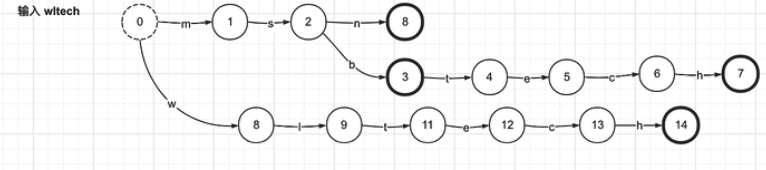
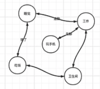
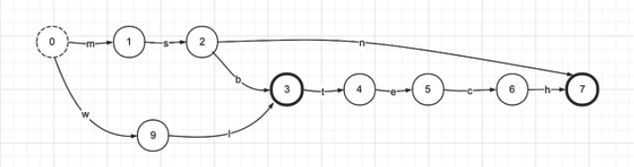

# 倒排索引 - Inverted Index

## 倒排表 - Posting List

- int有序数组：存储了匹配某个term的所有id
  - RBM: Roaring Bitmaps
  - FOR: Frame Of Reference

### FOR: Frame Of Reference

只适合稠密数据（前后差值较小）

> 1,2,3,...,100W个
>
> 1 int = 4Byte, 400W Byte = 4MB = 3200W bit

Delta List: 存储当前数字和前一个数字的差值

> 1,2,3,...,100W个, 1 int = 1 bit, 100W bit
>
> list:
>
> [73, 300, 302, 322, 343, 372]
>
> posting list:
>
> [73, 227, 2 ,30, 11, 29] -- 8 bit each = 256
>
> 优化拆分(拆分数量越多meta占用越多)
>
> [73, 227] -- 8 bit each(meta 1 byte)  [2, 30, 11, 29] -- 5 bit each(meta 1 byte)

### RBM: Roaring Bitmaps

适合稀疏数据（前后差值较大）

> [1000, 62101, 131385, 132052] -- 2(16) * 2(16)
>
> 除以65536
>
> (0, 1000), (0, 62101), (2, 313), (2, 980) -- 熵(二进制前16位)和余数(二进制后16位)

|short key|Container|
|---|---|
|0|1000, 62101|
|2|313, 980|

- Array Container
- BitMap Container
- Range Container

## 词项字典 - Term Dictionary

- tip: 词典索引，存放前缀后缀指针，需要内存加载
- tim: 后缀词块，倒排表指针
- doc: 倒排表、词频

按照term字典序生成最小化FST

### 字典树（前缀树） - Tire

前缀相同可复用节点，后缀相同无法复用

### 有限状态机 - FSM(Finite State Machines)

表示有限个状态集合以及这些状态之间转移和动作的数学模型，其中一个状态被标记为开始状态，0个或更多的状态被标记为final状态。

- 有限个状态
- 同一时间只能处于同一个状态
- 状态是无序的

### 有限状态接收机 - FSA

- 确定性：在任何给定状态下，对于任何输入，最多只能遍历一个transition
- 非循环：不可能重复遍历同一个状态
- Final唯一性：当且仅当有限状态机在输入序列的末尾处于“最终”状态时，才“接受”特定的输入序列（即存在）

### 有限状态转换器 - FST

实现Key到Value的映射，相当于HashMap<Key, Value>，查询速度慢于HashMap，但极大节省空间。

FST在Lucene中大量使用，如倒排碎银存储，同义词词典存储，搜索关键词建议等。

FST相比于FSA，在终止节点带有一个value。

## 词项索引 - Term Index

极大的节省内存，FST压缩倍率最高可以达到20倍，性能不如HashMap
