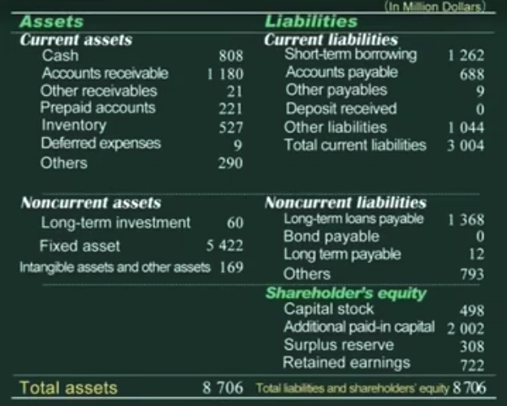
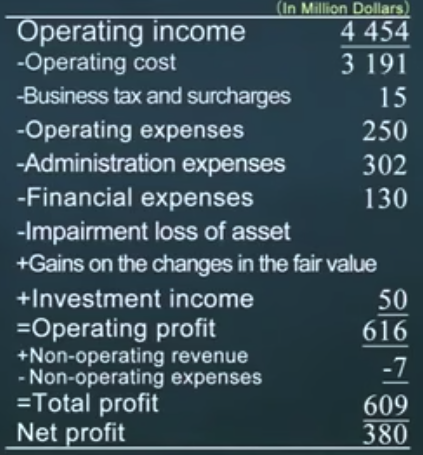
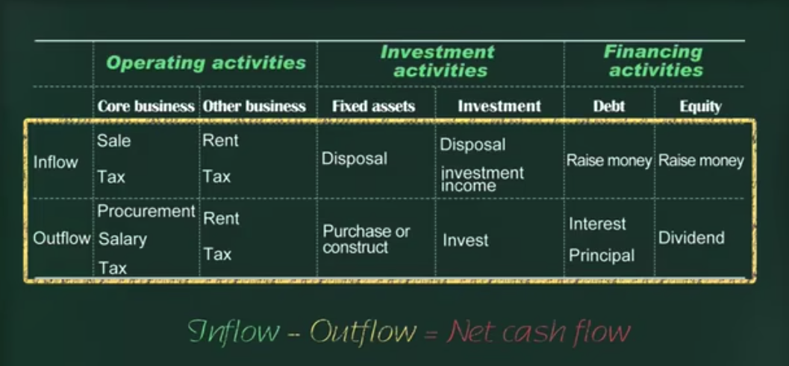
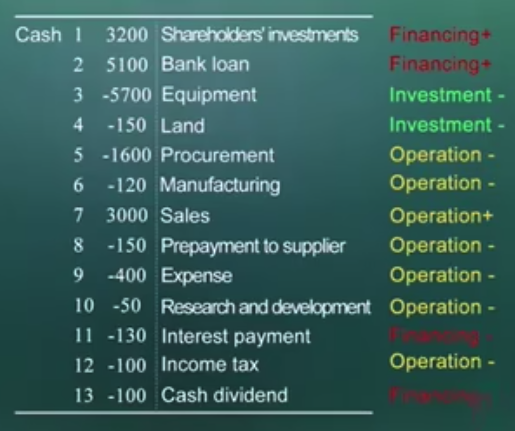
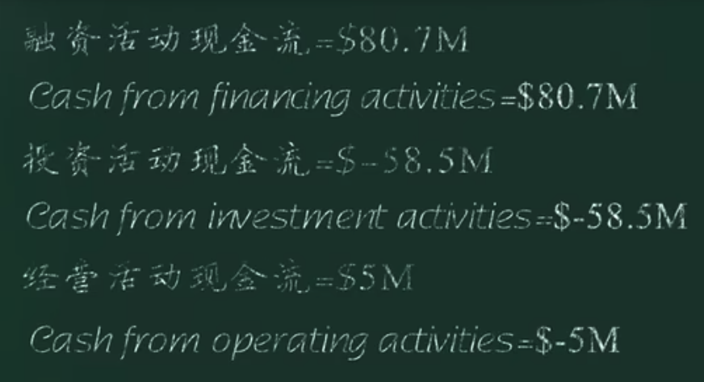

# 财务报表分析

## 种类

- 资产负债表(balance sheet)
- 利润表(income statement)
- 现金流表(cash flow statement)

## 企业活动

- 经营
- 投资
- 融资

## 资产负债表

了解投入的本金，在经营活动中变成了什么？

资产 = 负债 + 股东权益

剩余求偿权：偿还全部债务后，剩下的是股东的，股东才是公司最终的风险和收益的承担者。

资产 ！= 财产物资（看得见、摸得着）

## 资产

### 流动资产

按照变成现金的速度排列

#### 货币资金(cash)

公司和银行里的钱

#### 应收账款(Accounts receivable)

客户欠的钱，可以收，但目前没有收的钱

#### 其他应收账款(Other receivable)

非销售产品客户欠的钱

员工出差备用金

中国特色：其他相关方借走的钱

#### 预付账款(Prepared Accounts)

提前付给供应商的钱

#### 存货(Inventory)

原材料，生产出来的产品，未完工的再成品

#### 待摊费用(Defered expenses)

花一笔钱出去，换来一个未来有用的东西，就是资产，如果什么都没留下，那就是费用

办公用品、预付租金、预付广告费

### 非流动资产

#### 投资(Long-term investment)

参股其他公司、投资子公司、购买债券

#### 固定资产(Fixed assets)

设备、厂房

#### 无形资产(Intangible assets and other assets)

专利、版权、土地使用权(中国)

> 资产的价值如何确定？
>
> **使用当时购买资产的价格 -- 历史成本，因为很难找到当前价格的依据**
>
> 如果升值了，忽略升值
>
> 以历史成本作为资产计价体系，在历史成本基础上，扣除资产的减值
>
> **金融资产、投资性房地产(非办公楼、厂房) -- 公允价值**
>
> 使用当时的价格

### 历史成本

在历史成本的原则下，只要这个资产不出售，它在我们报表上的价值永远是他当时购买的价格，只能让这个资产价值减少，为了增加资产价值就只能重新发生交易。

## 负债(Liability)

### 流动负债(Current Liability)

#### 短期借款(Short-term borrowing)

一年以内偿还

#### 应付账款(Account payable)

欠了别人的钱

#### 其他应付款(Other payables)

#### 预收账款(Deposit received)

供应商预收的钱

#### 其他负债(Other liabilities)

欠员工的钱（应付工资）、欠的税（应交税金）

### 长期负债(Noncurrent liabilities)

#### 长期借款(Long-term borrowing)

一年以后偿还

#### 应付债券(Bond payable)

#### 长期应付款(Long term payable)

融资性租赁（期限长、金额大、分期付款购买资产）
租赁：经营性租赁/融资性租赁（期限长、金额大、分期付款购买资产）

## 股东权益(Shareholders' equity)

### 股本(Capital stock)

等于公司的注册资本，结构体现了股东之间的利益分割（按股本的比例）

### 资本公积(Additional paid-in capital)

除股本外，股东投的钱

### 盈余公积(Surplus reserve)

法律不让分配的利润（中国10%）

### 为分配利润(Retained earnings)

股东决定不分配的利润

## 利润表(Income statement)

到底有没有赚到钱

- 净利润 = 利润总额 - 所得税
- 毛利 = 收入 - 成本
- 税前利润 = 毛利 - 费用

### 营业收入(Operating income)

卖掉东西的收入

### 营业成本(Operating cost)

卖掉东西的成本

### 营业税金及附加(Business tax and surcharges)

通常只包含营业税、增值税附加税费

### 流转税(Turnover taxes)

只要有业务，不管赚没赚到钱都得交

#### 营业税

价内税，经营者承担

#### 增值税

价外税，消费者承担，应该体现在经营者应交税金中

### 期间费用

#### 营业费用(Operating expense)

广告费、运费、仓储费

#### 管理费用(Administration expense)

管理人员工资，办公楼折旧

#### 财务费用(Financial exprenses)

存款利息

### 投资收益(Investment income)

### 资产减值损失(Imairment loss of asset)

### 公允价值变动的收益(Gains on the changes in the fair value)

### 营业外收入

跟经营活动无关，不可持续

### 营业外支出

跟经营活动无关，不可持续，额外损失

### 补贴收入

政府补贴

### 汇兑损益(Exchange gain and loss)

## 现金流量表

收到和付出钱的情况

体现流入和流出在经营过程中的分布情况，描述现金的来龙去脉。

现金关系到企业的生死存亡，描述了这个企业的风险状况。

按融资、投资、经营归类后，得出各部分现金流

## 为什么要做这三张报表

- 利润表: 描述经营活动
- 资产负债表: 描述投融资活动
- 现金流量表: 描述风险状况

两个维度

- 现金流量表: 这个企业能否活下去
- 资产负债表 & 利润表: 能活下去，这个企业是什么样的

## 资产

企业报表中的资产，是可以使用货币表现的资源

### 流动资产

一年内可以转化为货币的资产

### 非流动资产

一年以上或一个经营周期以上，能转换为货币的资产
