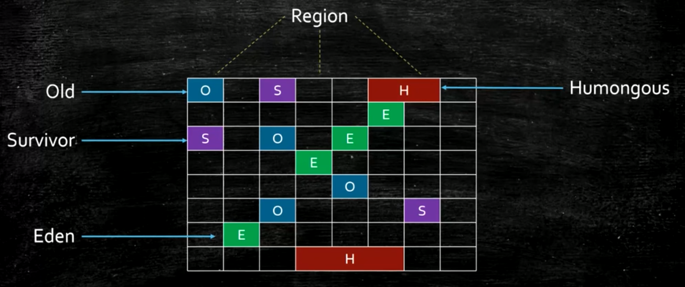

# Java 9

## G1 GC
在JDK9中，G1作为为默认的垃圾收集器，相比于吞吐量优先的Parallel GC（之前版本默认的垃圾收集器，当前已被声明为不推荐使用），G1拥有更好的整体体验。
> JDK-8081607 : Change default GC for server configurations to G1
> JEP 291：Deprecate the Concurrent Mark Sweep(CMS)Garbage Collector

作为CMS收集器的替代者和继承人，设计者们希望做出一款能够建立起“停顿时间模型”（Pause Prediction Model）的收集器，停顿时间模型的意思是能够支持指定在一个长度为M毫秒的时间片段内，消耗在垃圾收集上的时间大概率不超过N毫秒这样的目标。

### 使用场景
- 堆配置为10GB或者更大，且超过50%的堆被存活对象占用
- 新对象创建和晋升老年代的速率变化很大
- 堆中空间碎片化严重
- 避免垃圾回收造成长时间停顿

### 内存布局
> 物理上分区不分代，逻辑上分代

在G1收集器出现之前的所有其他收集器，包括CMS在内，垃圾收集的目标范围要么是整个新生代（Minor GC），要么就是整个老年代（Major GC），再要么就是整个Java堆（Full GC）。

G1开创的基于Region的堆内存布局是它能够实现这个目标的关键。G1不再坚持固定大小以及固定数量的分代区域划分，而是把连续的Java堆划分为多个大小相等的独立区域（Region），每一个Region都可以根据需要，扮演新生代的Eden空间、Survivor空间，或者老年代空间，收集器能够对扮演不同角色的Region采用不同的策略去处理.

虽然G1仍然保留新生代和老年代的概念，但新生代和老年代不再是固定的了，它们都是一系列区域（不需要连续）的动态集合。在进行垃圾收集时，无需处理整个新生代或老年代，而是将Region作为单次回收的最小单元，即每次收集到的内存空间都是Region大小的整数倍，这样可以有计划地避免在整个Java堆中进行全区域的垃圾收集。

### Humongous 
Region中还有一类特殊的Humongous区域，专门用来存储大对象。G1认为只要大小超过了一个Region容量一半的对象即可判定为大对象。每个Region的大小可以通过参数-XX：G1HeapRegionSize设定，取值范围为1MB～32MB，且应为2的N次幂。而对于那些超过了整个Region容量的超级大对象，将会被存放在N个连续的Humongous Region之中，G1的大多数行为都把Humongous Region作为老年代的一部分来进行看待。

虽然G1仍然保留新生代和老年代的概念，但新生代和老年代不再是固定的了，它们都是一系列区域（不需要连续）的动态集合。G1收集器之所以能建立可预测的停顿时间模型，是因为它将Region作为单次回收的最小单元，即每次收集到的内存空间都是Region大小的整数倍，这样可以有计划地避免在整个Java堆中进行全区域的垃圾收集。更具体的处理思路是让G1收集器去跟踪各个Region里面的垃圾堆积的“价值”大小，价值即回收所获得的空间大小以及回收所需时间的经验值，然后在后台维护一个优先级列表，每次根据用户设定允许的收集停顿时间（使用参数-XX：MaxGCPauseMillis指定，默认值是200毫秒）。

### 清理算法
与CMS的“标记-清除”算法不同，G1从整体来看是基于“标记-整理”算法实现的收集器，但从局部（两个Region之间）上看又是基于“标记-复制”算法实现。在收集Region时，其中存活对象会被复制到新的Region中并同时进行“整理”。

这两种算法都意味着G1运作期间不会产生内存空间碎片，垃圾收集完成之后能提供规整的可用内存。这种特性有利于程序长时间运行，在程序为大对象分配内存时不容易因无法找到连续内存空间而提前触发下一次收集。

### 配置参数
|参数|说明|
|---|---|
|-XX:+UseG1GC|启用G1收集器|
|-XX:MaxGCPauseMillis=200|最大停顿时间|
|-XX:GCPauseTimeInterval=\<ergo>|最大停顿时间间隔，默认情况下不设置，以便在极端场景下可以连续执行收集|
|-XX:ParallelGCThreads=\<ergo>|垃圾收集停顿时，并行执行收集的最大线程数，如果CPU数量等于8，使用CPU数量，否则使用计算共识 8 + ((N - 8) * 5/8) |
|-XX:ConcGCThreads=\<ergo>|并发执行线程数量，默认为ParallelGCThreads/4|
|-XX:+G1UseAdaptiveIHOP||
|-XX:InitiatingHeapOccupancyPercent=45||
|-XX:G1HeapRegionSize=\<ergo>|Region区域大小（1-32MB，需为2的指数），根据堆大小配置计算最多有2048个Region|
|-XX:G1NewSizePercent=5|新生代所占比例|
|-XX:G1MaxNewSizePercent=60||
|-XX:G1HeapWastePercent=5||
|-XX:G1MixedGCCountTarget=8||
|-XX:G1MixedGCLiveThresholdPercent=85||

### G1调优
总体来说建议使用G1默认的配置，与其他收集器不同，G1并不倾向于达成最大吞吐量或是最低时延，而是达成高吞吐量的同时保持较小的时延。

如果你倾向于高吞吐量，可以通过-XX:MaxGCPauseMillis增加停顿时间或分配更大的堆空间；如果倾向于低时间则可以降低停顿时间。

使用G1时应避免限制新生代大小，如使用-Xmn -XX:NewRatio ，因为G1主要是通过调整新生代来达成短时延的，增加了这些配置会导致G1对于时延的优化失效。

#### CMS到G1
从CMS切换到G1，最好移除掉所有影响垃圾收集的配置信息，仅保留暂停时间(MaxGCPauseMillis)和对大小(-Xmx，-Xms)的配置。

### 提升G1性能
G1被设计为使用更少的调优参数也能达到更好的整体性能，大多数情况下对应用的调优相比于调整VM参数，能取得更好的效果。

G1提供了丰富的log内容，可通过使用-Xlog:gc*=debug，并从中提取有效的信息。

#### 监控Full GC
Full GC耗时很高，一般由于堆的老年代空间使用率较高导致，可在GC日志中打印的*Pause Full (Allocation Failure)*来观察，在Full GC前一般会出现垃圾收集失败*to-space exhausted*标识。

当并发标记阶段耗时长，从而无法及时触发空间回收阶段时，会导致应用创建对象无法及时回收，触发Full GC。通过降低老年代分配速率，或增加并发标记时间，确保并发标记能够按时完成。

可通过以下G1选项来解决Full GC频繁问题：
- 可通过*gc+heap=info*日志确定堆中超大对象占用的Region数量，日志中*Humongous regions: X->Y*的Y表示超大对象占据的数量。如果这个数值高于老年代Region数量，最好的方式是减少创建这类对象，或者通 *-XX:G1HeapRegionSize* 增加Region大小

- 增加堆内存大小，这样可以增加标记完成的时间
- 增加并发标记线程数 *-XX:ConcGCThreads*
- 强制G1提前触发标记。G1通过观测应用之前的行为，来决定堆占用百分比域值(IHOP)，如果应用行为发生变化，预测结果可能是错误的，有以下两种解决方式：
    - 通过 *-XX:G1ReservePercent*参数预留空间来提前触发回收操作
    - 通过 *XX:-G1UseAdaptiveIHOP*和 *-XX:InitiatingHeapOccupancyPercent*参数来禁用IHOP，并手动设置域值

除此之外，外部工具也可通过 *System.gc()* 调用来触发Full GC，可通过 *-XX:+ExplicitGCInvokesConcurrent* 降低影响或 *-XX:+DisableExplicitGC* 来忽略。

#### Humongous 对象碎片化
当需要分配连续的Region区域时，即便堆空间仍有空余，也可能会导致Full GC的产生。可通过提升参数 *-XX:G1HeapRegionSize* 来降低大对象的数量，或可通过增加堆的大小来缓解。极端场景下，Full GC后仍无法获取到连续的大空间分配给对象，会导致VM退出。此时只能尝试降低大对象的数量，或增加堆空间的大小。

#### 延时优化
**系统异常**

每次GC停顿时，日志中都会记录耗时的分布，例如：User=0.19s Sys=0.00s Real=0.01s。
- User：虚拟机代码执行耗时
- Sys：操作系统执行耗时
- Real：停顿绝对时间

系统时间较长原因如下：
- 虚拟机从操作系统获取或归还内存空间，会导致一定延时，可通过设置堆最小于最大空间相等（-Xms，-Xmx），并预加载（-XX:+AlwaysPreTouch）在虚拟机启动时完成。
- 在Linux系统中，Transparent Huge Pages (THP)功能将小页合并为大页会导致进程停止运行，因虚拟机分配了大量内存，有较高的概率被停止运行一段时间，可查看对应操作系统关于THP的说明。
- 当部分程序占用了全部磁盘I/O时，可能导致日志输出停顿等待，可考虑使用独立的磁盘或使用内存文件系统来记录日志。

**对象处理耗时过长**

*Reference Processing*阶段显示了处理引用对象耗时，根据配置参数 *-XX:ReferencesPerThread* 为对一个数量对象启用一个线程，线程数量上限受 *-XX:ParallelGCThreads* 参数限制。

**新生代回收耗时过长**

一般莱索新生代回收耗时与新生代的大小相关，更确切的说是与需要复制的存活对象数量相关。如果*Evacuate Collection Set*耗时过长，，特别是*Object Copy*阶段，可降低 *-XX:G1NewSizePercent* 参数，来减小新生代的最小空间，从而减少停顿时间。

**混合回收耗时过长**

混合回收用于回收老年代空间，包括回收新生代和老年代Region区域，可通过启用 *gc+ergo+cset=trace*日志来查看新生代Region和老年代Region回收时间。

降低老年代回收耗时方法如下：
- 增加 *-XX:G1MixedGCCountTarget*参数值可将老年代Region回收分散至多次垃圾回收。
- 避免通过 *-XX:G1MixedGCLiveThresholdPercent* 参数不将包含大对象Region放入候选回收集合中，通常占用率高的Region回收时间相应较长。
- 可通过增加 *-XX:G1HeapWastePercent*参数来减小G1回收高占用率Region数量，来减小老年代回收耗时。

注意后两个方法是通过减少回收Region数量来达成减少耗时的，在持续内存分配过程中可能导致回收不及时，放在后续的GC中进行回收。

**更新/扫描RS耗时高**

